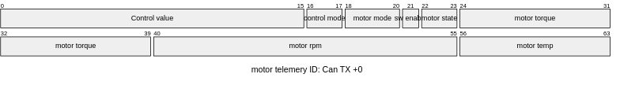
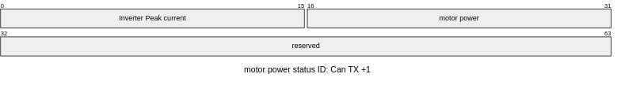
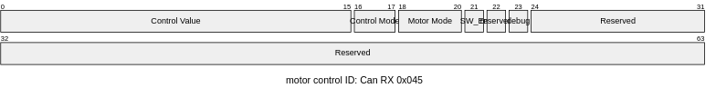

= Motor 

This document details the driver and can messages of the GEMmotors G1.X motor controller, interfacing via the CAN bus.

Manual/datasheet (External PDF): link:https://hannl-my.sharepoint.com/personal/jaap_janssens_han_nl/_layouts/15/onedrive.aspx?CID=f663e4aa-0285-40f3-a3e6-5114972ff027&id=%2Fpersonal%2Fjaap_janssens_han_nl%2FDocuments%2FHAN%20Hydromotive%2F2024-2025%2FPowertrain%2Ftelemetry-unit%2FTelemetry%20unit%202024%2Fhardware%2Fdocumentation%2FGEMMotors-G1.X-REV008.pdf&parent=%2Fpersonal%2Fjaap_janssens_han_nl%2FDocuments%2FHAN%20Hydromotive%2F2024-2025%2FPowertrain%2Ftelemetry-unit%2FTelemetry%20unit%202024%2Fhardware%2Fdocumentation[GEMmotors-G1.X-REV008]

== Data Structures
These classes store data parsed from CAN messages.
All inherit from `ILoggable` for standardized logging.

=== MotorTelemetry (CAN ID: `0x064`)

Holds comprehensive telemetry from the motor controller.

|===
| Field | Type | Description | CAN Bytes

| `control_value`
| `int16_t`
| Current control value reported by the motor.
| 0-1

| `control_mode`
| `uint8_t`
| Current control mode.
| 2 (Bit 0)

| `motor_mode`
| `uint8_t`
| Current motor operational mode.
| 2 (Bits 1-3)

| `sw_enable`
| `uint8_t`
| Software enable status.
| 2 (Bit 4)

| `motor_state`
| `uint8_t`
| Current motor operational state.
| 2 (Bits 6-7)

| `motor_torque`
| `int16_t`
| Measured motor torque (Nm).
| 3-4

| `motor_rpm`
| `int16_t`
| Measured motor speed (0.1 RPM resolution).
| 5-6

| `motor_temp`
| `int8_t`
| Maximum inverter temperature (°C).
| 7
|===

=== MotorPower (CAN ID: `0x065`)
Holds power and current data.

|===
| Field | Type | Description | CAN Bytes

| `inv_peak_cur`
| `int16_t`
| Maximum PEAK current of all inverters (A).
| 0-1

| `motor_power`
| `int16_t`
| Current motor power (W).
| 2-3
|===

=== MotorCtrlCommand (CAN ID: `0x045`)

Represents status/feedback related to motor control commands.

|===
| Field | Type | Description | CAN Bytes

| `control_value`
| `uint8_t`
| Control value status/feedback.
| 1

| `control_mode`
| `uint8_t`
| Control mode status.
| 3 (Bits 0-1)

| `motor_mode`
| `uint8_t`
| Motor mode status.
| 3 (Bits 2-4)

| `sw_enable`
| `uint8_t`
| Software enable status.
| 3 (Bit 5)

| `debug_mode`
| `uint8_t`
| Debug mode status.
| 3 (Bit 7)
|===

== Configurable Logging

The `toString()` method for each data class generates a log string.
The content is compile-time controlled by `PARSE_...` boolean constants in `Config.hpp`.

=== MotorTelemetry::toString()
* *Prefix:* `MTL`
* *Conditional Fields:* `control_value`, `control_mode`, `motor_mode`, `sw_enable`, `motor_state`, `motor_torque`, `motor_rpm`, `motor_temp`

.Output format(with all flags enabled)
----
MTL,<control_value>,<control_mode>,<motor_mode>,<sw_enable>,<motor_state>,<motor_torque>,<motor_rpm>,<motor_temp>
----

=== MotorPower::toString()
* *Prefix:* `MPW`
* *Conditional Fields:* `motor_power`, `inv_peak_cur`

.Output format(with all flags enabled)
----
MPW,<motor_power>,<inv_peak_cur>
----

=== MotorCtrlCommand::toString()
* *Prefix:* `THR`
* *Conditional Fields:* `control_value`, `control_mode`, `motor_mode`, `sw_enable`, `debug_mode`

.Output format(with all flags enabled)
----
THR,<control_value>,<control_mode>,<motor_mode>,<sw_enable>,<debug_mode>
----

== Configuration-Driven System
The driver's behavior is governed by compile-time constants in `Config.hpp`. This allows tailoring resource consumption and data output without modifying core logic.

Key configuration parameters for each message type include:

*  `ID`: The CAN message identifier.
*    `DATA_LENGTH`: Expected data length code (DLC) for the message.
*    `FILTER_BANK`: The hardware CAN filter bank to be used.
*   `PARSE_...` flags: A set of booleans that enable or disable the parsing and logging of individual data fields.
*   `static_assert`: Ensures that at least one `PARSE_...` flag is enabled for each active message type, preventing dead configurations.

== Data Flow Diagram

[mermaid]
----
flowchart LR
    A[CAN Bus: GEMmotors ] -->|Raw CAN Messages: ID, Data, DLC| B(CanDispatcher: Routes Messages)
    B --> C(CAN ID: 0x064)
    B --> D(CAN ID: 0x065)
    B --> E(CAN ID: 0x045)
    C --> F(CanTelemetryHandler
     - Registers Filter
     - Handles Raw Data
     - Decodes)

    D --> G(CanPowerHandler
     - Registers Filter
     - Handles Raw Data
     - Decodes)

    E --> H(CanControlCommandHandler
     - Registers Filter
     - Handles Raw Data
     - Decodes)

    F-->|Updates based on Config.hpp| R[MotorTelemetry
    ILoggable Data
    CAN ID 0x064 Data]

    G-->|Updates based on Config.hpp| K[MotorPower
    ILoggable Data
    CAN ID 0x065 Data]

    H-->|Updates based on Config.hpp| L[MotorCtrlCommand
    ILoggable Data
    CAN ID 0x045 Data]
----

== Contact
Vladimirs Jurcenoks - link:https://gitlab.com/Vladimir-create[@Vladimir-create] - mailto:v.jurcenoks@student.han.nl[v.jurcenoks@student.han.nl]

link:https://gitlab.com/hydromotive/2425-acquistionmodule-dev[Project Link]
