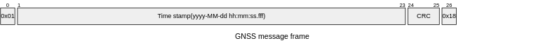

= Common protocol specification

This document contains the common parts of the Protocol specification from the collection unit to the transmission unit and to the Logger.
As well as the Protocol used by the GPS system built by Remko Welling.

== Logging protocol info 

== ESP protocol info
The data going to the ESP from data collection system is surrounded by a start and a stop character, 0x01 and 0x18 respectively.
For verification of the data integrity a 16 bit CRC is used. 
In the specification there is also a 16 bit CRC which.
If the start or stop character appear in the CRC there is an escape character (0x10) added.

NOTE: The information above does not apply to the data going into the OpenLog.

== GPS Time Info

The information from the GNSS unit is send to the collection unit with a variable length frame.

NOTE: The CRC length is variable from 2 up to 4 bytes for escaping the start, stop and escape character.

The following image show the data send by the GNSS unit in bytes

.GPS Protocol in bytes

