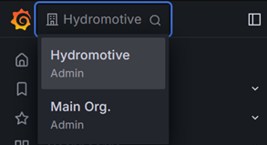

= Configuration of Grafana

In this section of the wiki, can you find the information about the structure of Grafana, How to configure data sources and how to add users.

== General structure of Grafana

In Grafana is it possible to create multiple organisations within one instance.

The default organisation is `Main Org.`. Unconfigured users have acces to this one, and in the current structure is *this organisation NOT used*

As shown in Figure 1, there is another organisation, named `Hydromotive`. This is organisation that has been used to create the visualization infrastructure.
Before creating visualization or datastructure, make sure that your on this organisation.

.Available organisations in Grafana

Under the tab (left side of screen) _Dashboards_ is there an folder created named _Hydromotive_. Under this folder you can find all the visualizations.

NOTE: When new visualization are created, they should be placed in this folder, unless they are not for Hydromotive.

== Users

Grafana has a user administration structure that might remind you of Linux filesystems. The superuser of Grafana is "admin" and should not be used for visualization development. It acts similarly to using root on a Linux system. The "admin" user has all the rights and is the only user that can change or add new data sources.

=== Creating New Users

There are two methods for creating new users: one is via an invitation, and the other is direct creation.

==== Create New User (Preferred)

1. *Log in as Admin*
- Ensure that the VPN connection is established.
- Use "admin" account

2. *Navigate to Users*
- Open the Grafana menu.
- Click on _Administration_.
- Then click on _Users and Access_.
- Finally, click on _Users_.

3. *Create User*
- Click on the _New User_ button.
- Fill in the form.
- Finally, click on _Create User_.

4. *Change the Organization and the Role*
- Remove the organization _Main Org._
- Click on _Add User to Organization_.
- Select _Hydormotive_.
- Select the appropriate role.

5. *Log in with New User*
- Log out with the current user.
- Log in with the newly created user.
- Check if this new user account can see all the visualizations and is in the correct organization.

==== Create New User via Invitation

[NOTE]
====
This method is untested; use at your own risk.
====

1. *Log in as Administrator*
- This can be any user with administrator rights in the organization.

2. *Navigate to Users*
- Open the Grafana menu.
- Click on _Administration_.
- Then click on _Users and Access_.
- Finally, click on _Users_.

3. *Create User*
+
NOTE: Emailing with Grafana is not configured.
+
    - Click on the _Invite_ button.
    - Fill in the form.
    - Assign the appropriate role.
    - Finally, click on _Submit_.

4. *Retrieve the Invitation Link*
+
[NOTE]
====
Grafana generates an invalid hostname address (localhost:3000); this needs to be    manually changed to the correct server.
====
+
- Click on _Pending Invites_.
- Then copy the invite link.
- Send the invite link to the user.

== Adding new data sources

Grafana has a lot of options to retrief data from different sources, take a look at their https://grafana.com/grafana/plugins/data-source-plugins/[datadsources plugin site].

1. *Log in as Admin*
- Ensure that the VPN connection is established.
- Use "admin" account

2. *Navigate to _Add new data sources_*
- Open the Grafana menu.
- Click on _connection_.
- Then click on _Add new connection_.

3. *Select your data source*
- Configure it

4. *Verify that the connection is valid*

== Installing Plugins

Grafana's experience can be enhanced by using plugins. For example, you can add new dashboards, data sources, or trivial features such as a button panel. To download and install plugins, you must use the "admin" user account.

1. *Log in as Admin*
- Ensure that the VPN connection is established.
- Use the "admin" account.

2. *Navigate to Plugins*
- Open the Grafana menu.
- Click on _Administration_.
- Then click on _Plugins and Data_.
- Finally, click on _Plugins_.

3. *Install Plugin*
- Click on the plugin that you want to install.
- Click on _Install_.

Now you can use the plugin in Grafana.

