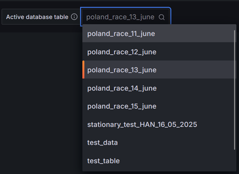
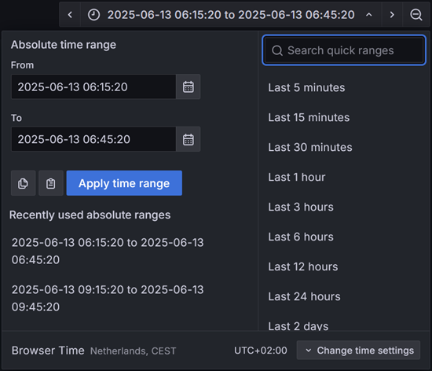

= History Visualization

image::images/History Visualization.png[History Visualization]

In this section of the wiki, we will discuss the history visualization. It explains the goal of this visualization and how it can be used.

== What is the History Visualization

The primary goal of the history visualization is to provide visual insights into the performance of the racecar. These dashboards are developed in close collaboration with Powertrain, as they can provide valuable insights into what is happening in the vehicle.

This visualization is meant to be used after the test day or race is over. With these graphs, you can see the performance on a large scale, which helps fine-tune components such as the fuel cell and the HUB motor.

== How to use this visualization

As you might have seen in Figure 1, the top part of the visualization contains several drop-down menus. With these menus, you can select different databases and tables to choose the preferred data sources.

This also highlights the important task of the members of the Telemetry Unit. They must ensure that the data is stored in the correct database and table; otherwise, selecting the tables will be useless, and finding the data will be much harder.

Zoomed in on the top row with specific means of configuring the current visualization:

From left to right in Figure 2:
- The database selector
- Table selector
- Data selection on a time basis

=== Database selector

Zoomed in on the option to select databases:

image::images/dropdown menu database.png[Dropdown menu to select databases]

The database selector is exactly what the name suggests. With this drop-down menu, you can select a database to which Grafana has access. By changing this option, it will change every graph to this database since all of them are connected to this variable.

[INFO]
====
For the visualization developer: This is a variable linked to this specific visualization and can be used in any query that is present. Use the dollar sign `$` to use variables. For selecting the database, the variable is `active_database`.
====

=== Table selector

The drop-down menu used for selecting a table with the preferred data:

It is useful to be able to change the database, but it is even more important to be able to change tables. With this option, you can select all the tables available in the database you have chosen with the database selector.

[INFO]
====
For the visualization developer: This is a variable linked to this specific visualization and can be used in any query that is present. Use the dollar sign `$` to use variables. For using the selected table, the variable is `active_table`.
====

== Data Selection on a time basis

Time selector, used when you want to see data on the dashboards:

Lastly, the time selector might be the most important feature of all. With this, you can select the dates between which you want to view the data. This is, by itself, a powerful mechanism and helps in displaying only the data you want to see. It can also act as a zoom functionality.
