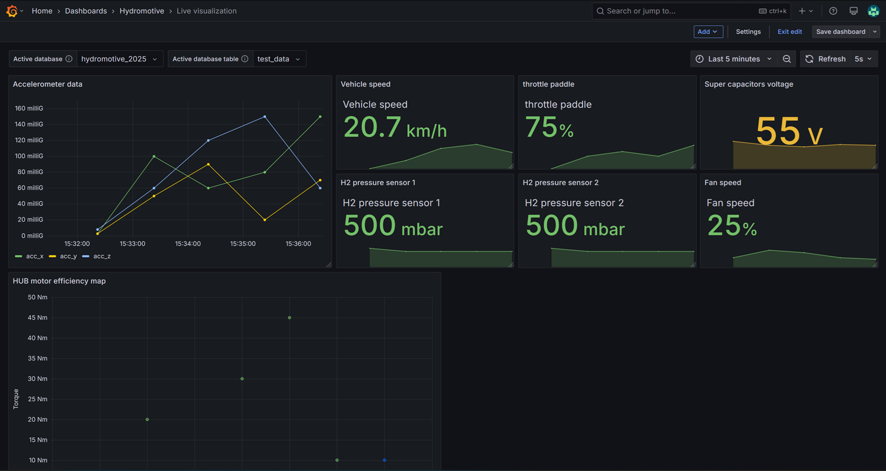
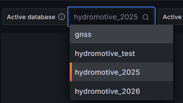
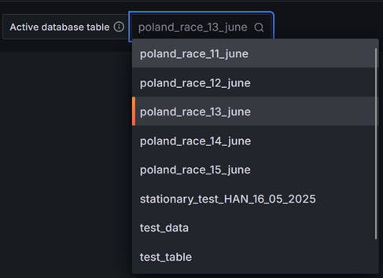
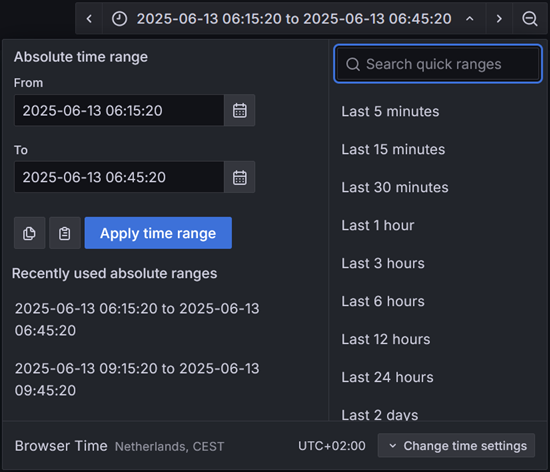
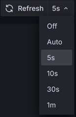

= Live Visualization

In this section of the wiki, we will discuss the live visualization. It explains the goal of this visualization and how it can be used.

== How to Use This Visualization

The live visualization is crafted to represent the incoming data from the vehicle, so that race strategists have valuable vehicle data at their fingertips.

During testing and races, this visualization provides insights into the performance of the car, such as the HUB motor and fuel cell. With this information, the people in the pit box can make educated decisions based on real data, preventing choices made solely on gut feeling.

Although it is possible to use this visualization for historical data by using the time selection, it is primarily designed for showing data from now up to, for example, the last 5 minutes.

Zoomed in on the top row with specific means of configuring the current visualization:

From left to right in Figure 2:
- The database selector
- Table selector
- Data selection on a time basis
- Automatic refesh of visualization

=== Database selector

Zoomed in on the option to select databases:

The database selector is exactly what the name suggests. With this drop-down menu, you can select a database to which Grafana has access. By changing this option, it will change every graph to this database since all of them are connected to this variable.

[INFO]
====
For the visualization developer: This is a variable linked to this specific visualization and can be used in any query that is present. Use the dollar sign `$` to use variables. For selecting the database, the variable is `active_database`.
====

=== Table selector

The drop-down menu used for selecting a table with the preferred data:

It is useful to be able to change the database, but it is even more important to be able to change tables. With this option, you can select all the tables available in the database you have chosen with the database selector.

[INFO]
====
For the visualization developer: This is a variable linked to this specific visualization and can be used in any query that is present. Use the dollar sign `$` to use variables. For using the selected table, the variable is `active_table`.
====

=== Data Selection on a time basis

Time selector, used when you want to see data on the dashboards:

Next is the time selector, which might be the most important feature of all. With this, you can select the dates between which you want to view the data. By itself, this is a powerful mechanism that helps in displaying only the data you want to see. Additionally, it can act as a zoom functionality.

=== Automatic Refresh of Visualization

Finally, the refresh and automatic refresh options. With the refresh button, you can, as the name implies, refresh all the visualizations. This means that every dashboard command is re-executed, and the dashboards will update with the newest data if it is in the dataset.

With the drop-down menu, you can select a couple of options to refresh after a set interval. This greatly helps the Live dashboard to be more real-time. By default, it is set to an interval of 5 seconds. This means that every 5 seconds, every query on this visualization is re-executed and shows the newest vehicle data.

== Contact

Julian Janssen - https://gitlab.com/GhostJulian[@GhostJulian]  - mailto:jwr.janssen@student.han.nl[jwr.janssen@student.han.nl]

Project Link: https://gitlab.com/hydromotive/2425-acquistionmodule-dev