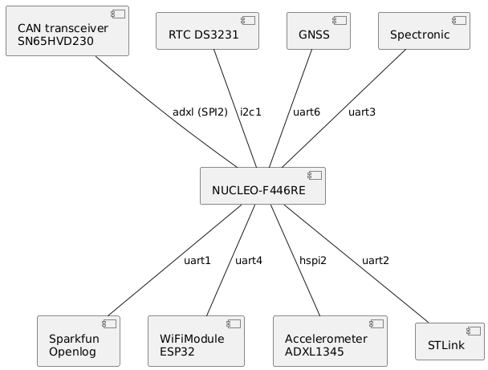

= PCB

The design of the PCB is centered around the STM32 NUCLEO-F446RE board.
This has a number of peripheral components that it is connected to for data collection and transmission.

.PCB component diagram

On the PCB there are 5 connectors and 4 sub-boards

.connectors
* Power
* CAN
* Spectronic
* ADXL345
* GNSS

.Sub-boards
* NUCLEO(Collection)
* ESP32 (transmission)
* Buck converter
* OpenLog

The above mentioned components and connectors are connected on the Main board to each other.
The mainboard also contains the realtime clock and the CAN Transceiver.

== Power supply

WARNING: When the board is powered from the Buck converter. The USB port on the nucleo will have 5 volts on it as well. 
Do *not* plug in a usb cable into the Nucleo this could damage the Laptop.

The board is powered of the Power connector located on the mainboard in the top right corner.
This then goes into the buck converter which steps down the incoming voltage to 5 Volts.
The buck converter is also reverse polarity protected.

== NUCLEO

The Nucleo board collects all data from the sensors and sources in the vehicle.
This means all inputs to the PCB are in some way routed to this board.

=== OpenLog
gets a serial input from the NUCLEO and logs the data to the microSD card 

== ESP32
Takes a serial input from the NUCLEO and transmits the average of all values received over a second.

