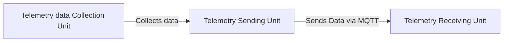

Welcome to the _Telemetry Sending Unit_ wiki page! Here, you will find detailed information on how to effectively use the software and contribute to its further development. Discover insights into the data flow, and understand the expected input and output data to maximize your experience with our tool.

The _Telemetry Unit_ consists of three major parts:

- Telemetry Data Collection Unit
- **Telemetry Sending Unit** (the current wiki)
- Telemetry Receiving Unit

All of these parts need to work in collaboration to function successfully. The main role of the _Telemetry Sending Unit_ is to collect and aggregate data from the _Telemetry Data Collection Unit_ and send it via a protocol to the _Telemetry Receiving Unit_.


# Table of contents

<!-- TOC -->
* [Table of contents](#table-of-contents)
* [List of abbreviations](#list-of-abbreviations)
* [Location to find information](#location-to-find-information)
* [Configuration](#configuration)
  * [Pin configuration and usage](#pin-configuration-and-usage)
  * [UART Configuration](#uart-configuration)
* [The dataflow](#the-dataflow)
  * [Dataflow in the Telemetry Sending Unit](#dataflow-in-the-telemetry-sending-unit)
<!-- TOC -->


# List of abbreviations

| abbreviations |                 Definition                  |
|:-------------:|:-------------------------------------------:|
|      IDE      |    Intergraded Development  Environments    |
|      CLI      |           Command Line Interface            |
|     UART      | Universal asynchronous receiver-transmitter |
|      RPM      |           Revolutions per minute            |
|      CRC      |           Cyclic Redundancy Check           |
|      MSB      |           Most Significant Bytes            |
|      LSB      |           Least Significant Bytes           |
|     MQTT      |     Message Queuing Telemetry Transport     |
|     hm25      |              Hydromotive 2025               |
|     JSON      |         JavaScript Object Notation          |


# Location to find information
- For installing a filesystem and upload code, [please see installation](Installation.md)


# Configuration

In this section of the wiki can you find the configuration of the Telemetry sending Unit. Here you can find the used Hardware pins, UARTS with their respected speeds.

## Pin configuration and usage

In _Table 1_ you can see all the used pins and their pin configuration.

_Table 1: shows the pin configuration and usage for all the pins used._

| Pin | PinMode |              Usage               |
|:---:|:-------:|:--------------------------------:|
|  4  | Output  |         Wi-Fi status LED         |
|  5  | Output  |         MQTT status LED          |
|  6  | Output  |         Spare status LED         |
|  9  |   RxD   |        RxD UART2 (Debug)         |
| 10  |   TxD   |        TxD UART2 (Debug)         |
| 17  |   TxD   | TxD UART1 (Data Collection Unit) |
| 18  |   RxD   | RxD UART1 (Data Collection Unit) |

## UART Configuration

This unit uses multiple UARTs. Table 2 provides the important information about these.

_Table 2: UART configurations_

| UART |          Description           | TxD pin | RxD pin | Baud   | UART configuation | 
|:----:|:------------------------------:|---------|---------|--------|:-----------------:|
|  1   | Telemetry Data Collection Unit | 17      | 18      | 460800 |    SERIAL_8N1     |
|  2   |        Debugging  UART         | 10      | 9       | 115200 |    SERIAL_8N1     |


# The dataflow

Since this is the second part in the Telemetry chain, it only needs to handle one data source: the _Data Collection Unit_.
In **Figure 1** presents a global overview of the dataflow.


_**Figure 1**: A global overview of the data flow of the Telemetry Unit, excluding data visualization._

## Dataflow in the Telemetry Sending Unit

By now, you should have a general idea of how the data flow is structured in the Telemetry Unit. Let's zoom in on the data flow of the Telemetry Sending Unit.

In **Figure 2**, you can see the full flowchart of the Telemetry Sending Unit, which also illustrates how the data processing works.

1. **UART Communication**:
    - The process begins with UART communication, where data is received. The data is captured between a `START_BYTE` and a `STOP_BYTE`. This step is crucial for initiating data capture.

2. **Data Capture**:
    - The received data is stored in a buffer (`messageBuffer`). The `capturing` flag indicates when data is being captured, ensuring that data is collected accurately.

3. **CRC Validation**:
    - Once a complete message is captured, it undergoes CRC validation. The `validateCRC` function checks the integrity of the message to ensure data accuracy and reliability.

4. **Data Processing**:
    - If the CRC is valid, the data is processed further. The data is converted to a null-terminated string and tokenized into CSV format, preparing it for the next stages of processing.

5. **Tokenization and Storage**:
    - The tokenizeCSV function splits the CSV message into tokens. These tokens are stored and checked for validity, ensuring that the data is correctly formatted and ready for aggregation.

6. **Data Aggregation**:
    - Depending on the data type (e.g., accelerometer, spectronik, motor), the data is aggregated. The `aggregateData` function averages the data samples, which is essential for accurate data representation.

7. **JSON Creation**:
    - The aggregated data is converted into a JSON structure. The `createJsonStruct` function formats the data into JSON, making it suitable for transmission.

8. **MQTT Publishing**:
    - Finally, the JSON message is published to an MQTT broker. The `mqttClient.publish` function sends the JSON message to the specified topic, completing the data flow process.

````mermaid
flowchart TD
  A[UART Communication] --> B[Data Capture]
  B --> C[CRC Validation]
  C -->|Valid| D[Data Processing]
  C -->|Invalid| E[Error Handling]
  D --> F[Tokenization and Storage]
  F --> G[Data Aggregation]
  G --> H[JSON Creation]
  H --> I[MQTT Publishing]

````
_**Figure 2**: The dataflow in the  Telemetry Sending unit._