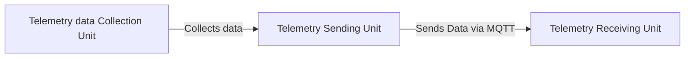
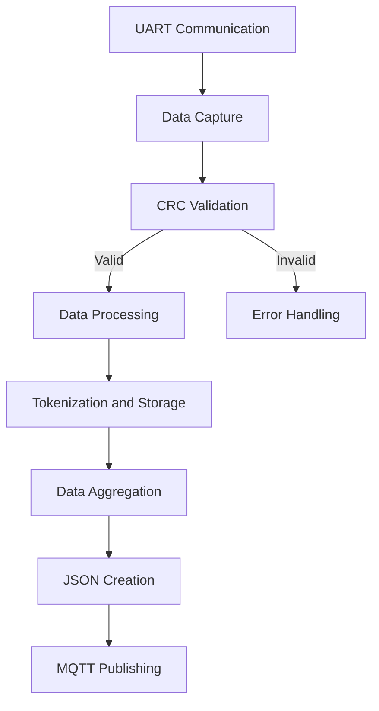

# The dataflow

Since this is the second part in the Telemetry chain, it only needs to handle one data source: the _Data Collection Unit_. In **Figure 1** presents a global overview of the dataflow.

**_Figure 1_**_: A global overview of the data flow of the Telemetry Unit, excluding data visualization._

## Dataflow in the Telemetry Sending Unit

By now, you should have a general idea of how the data flow is structured in the Telemetry Unit. Let's zoom in on the data flow of the Telemetry Sending Unit.

In **Figure 2**, you can see the full flowchart of the Telemetry Sending Unit, which also illustrates how the data processing works.

1. **UART Communication**:
   - The process begins with UART communication, where data is received. The data is captured between a `START_BYTE` and a `STOP_BYTE`. This step is crucial for initiating data capture.
2. **Data Capture**:
   - The received data is stored in a buffer (`messageBuffer`). The `capturing` flag indicates when data is being captured, ensuring that data is collected accurately.
3. **CRC Validation**:
   - Once a complete message is captured, it undergoes CRC validation. The `validateCRC` function checks the integrity of the message to ensure data accuracy and reliability.
4. **Data Processing**:
   - If the CRC is valid, the data is processed further. The data is converted to a null-terminated string and tokenized into CSV format, preparing it for the next stages of processing.
5. **Tokenization and Storage**:
   - The tokenizeCSV function splits the CSV message into tokens. These tokens are stored and checked for validity, ensuring that the data is correctly formatted and ready for aggregation.
6. **Data Aggregation**:
   - Depending on the data type (e.g., accelerometer, spectronik, motor), the data is aggregated. The `aggregateData` function averages the data samples, which is essential for accurate data representation.
7. **JSON Creation**:
   - The aggregated data is converted into a JSON structure. The `createJsonStruct` function formats the data into JSON, making it suitable for transmission.
8. **MQTT Publishing**:
   - Finally, the JSON message is published to an MQTT broker. The `mqttClient.publish` function sends the JSON message to the specified topic, completing the data flow process.

**_Figure 2_**_: The dataflow in the Telemetry Sending unit._