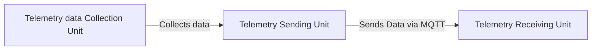

# The telemetry Sending unit

Welcome to the _Telemetry Sending Unit_ wiki page! Here, you will find detailed information on how to effectively use the software and contribute to its further development. Discover insights into the data flow, and understand the expected input and output data to maximize your experience with our tool.

The _Telemetry Unit_ consists of three major parts:

- Telemetry Data Collection Unit
- **Telemetry Sending Unit** (the current wiki)
- Telemetry Receiving Unit

All of these parts need to work in collaboration to function successfully. The main role of the _Telemetry Sending Unit_ is to collect and aggregate data from the _Telemetry Data Collection Unit_ and send it via a protocol to the _Telemetry Receiving Unit_.

# Table of contents

<!-- TOC -->
* [The telemetry Sending unit](#the-telemetry-sending-unit)
* [Table of contents](#table-of-contents)
* [List of abbreviations](#list-of-abbreviations)
* [Installation](#installation)
  * [Prerequisites](#prerequisites)
    * [Links to install these prerequisites](#links-to-install-these-prerequisites)
  * [First time working with the Telemetry Sending Unit software](#first-time-working-with-the-telemetry-sending-unit-software)
* [The dataflow](#the-dataflow)
  * [Dataflow in the Telemetry Sending Unit](#dataflow-in-the-telemetry-sending-unit)
    * [Overview of the expected data](#overview-of-the-expected-data)
      * [Format of Accelerometer data](#format-of-accelerometer-data)
      * [Format of Motor Telemetry data](#format-of-motor-telemetry-data)
      * [Format of Motor Power data](#format-of-motor-power-data)
      * [Format of Spectronik data](#format-of-spectronik-data)
      * [Format of Throttle data](#format-of-throttle-data)
    * [Overview of the raw expected data](#overview-of-the-raw-expected-data)
      * [Raw format of the Accelerometer](#raw-format-of-the-accelerometer)
      * [Raw format of the Motor Telemetry](#raw-format-of-the-motor-telemetry)
      * [Raw format of the Motor Power](#raw-format-of-the-motor-power)
      * [Raw format of the Spectronik](#raw-format-of-the-spectronik)
      * [Raw format of the Throttle](#raw-format-of-the-throttle)
  * [Contact](#contact)
<!-- TOC -->

# List of abbreviations

| abbreviations |                 Definition                  |
|:-------------:|:-------------------------------------------:|
|      IDE      |    Intergraded Development  Environments    |
|      CLI      |           Command Line Interface            |
|     UART      | Universal asynchronous receiver-transmitter |
|      RPM      |           Revolutions per minute            |
|      CRC      |           Cyclic Redundancy Check           |
|      MSB      |           Most Significant Bytes            |
|      LSB      |           Least Significant Bytes           |


# Installation

**The Telemetry Sending Unit software** is fully developed in PlatformIO. The software is developed in CLion 2025 using the PlatformIO plugin, primarily due to personal preference. However, any other supported Integrated Development Environment (IDE) should work as well.

PlatformIO is a plugin for popular C++ IDEs such as Visual Studio Code, Eclipse and CLion. It supports a wide range of microcontrollers from various brands, including Espressif, AVR, NXP, STM32, and many more.

The primary reason for choosing PlatformIO is its extensive support for easily switching between microcontrollers using the `platformio.ini` file, as well as its wide range of community libraries.


## Prerequisites

- PlatformIO Plugin.
- PlatformIO Core, CLI tool (Optional).
- Visual Studio Code / CLion (or any other supported IDE for PlatformIO).


### Links to install these prerequisites

- [Download page of PlatformIO](https://platformio.org/).
- [PlatformIO Core (CLI tool, is optional)](https://docs.platformio.org/en/latest/core/index.html).
- C++ IDE
  - [Full List of Supported IDEs for PlatformIO](https://platformio.org/install/integration).
  - [Visual Studio Code download page](https://code.visualstudio.com/).
  - [Clion download page](https://www.jetbrains.com/clion/).


## First time working with the Telemetry Sending Unit software

Getting started and further developing the Telemetry Sending Unit software is straightforward. Follow these steps:

1. [Clone the repository, if you haven't already](https://gitlab.com/hydromotive/2425-acquistionmodule-dev).
2. Open your favorite (and supported) IDE with the PlatformIO plugin installed.
3. Click on _Open..._ (in CLion, the shortcut is: `CTRL + O`).
4. Navigate to `<root of repository folder>\telemetry-unit\`.
5. Open the folder `telemetry-sending`.

Now, the PlatformIO plugin will initialize, and the build targets and configuration will be loaded.


# The dataflow

Since this is the second part in the Telemetry chain, it only needs to handle one data source: the _Data Collection Unit_.


_**Figure 1**: A global overview of the data flow of the Telemetry Unit, excluding data visualization._

## Dataflow in the Telemetry Sending Unit

By now, you should have a general idea of how the data flow is structured in the Telemetry Unit. Let's zoom in on the data flow of the Telemetry Sending Unit.

In **Figure 2**, you can see the full flowchart of the Telemetry Sending Unit, which also illustrates how the data processing works.

1. **UART Communication**:
   - The process begins with UART communication, where data is received. The data is captured between a `START_BYTE` and a `STOP_BYTE`. This step is crucial for initiating data capture.

2. **Data Capture**:
   - The received data is stored in a buffer (`messageBuffer`). The `capturing` flag indicates when data is being captured, ensuring that data is collected accurately.

3. **CRC Validation**:
   - Once a complete message is captured, it undergoes CRC validation. The `validateCRC` function checks the integrity of the message to ensure data accuracy and reliability.

4. **Data Processing**:
   - If the CRC is valid, the data is processed further. The data is converted to a null-terminated string and tokenized into CSV format, preparing it for the next stages of processing.

5. **Tokenization and Storage**:
   - The tokenizeCSV function splits the CSV message into tokens. These tokens are stored and checked for validity, ensuring that the data is correctly formatted and ready for aggregation.

6. **Data Aggregation**:
   - Depending on the data type (e.g., accelerometer, spectronik, motor), the data is aggregated. The `aggregateData` function averages the data samples, which is essential for accurate data representation.

7. **JSON Creation**:
   - The aggregated data is converted into a JSON structure. The `createJsonStruct` function formats the data into JSON, making it suitable for transmission.

8. **MQTT Publishing**:
   - Finally, the JSON message is published to an MQTT broker. The `mqttClient.publish` function sends the JSON message to the specified topic, completing the data flow process.

````mermaid
flowchart TD
  A[UART Communication] --> B[Data Capture]
  B --> C[CRC Validation]
  C -->|Valid| D[Data Processing]
  C -->|Invalid| E[Error Handling]
  D --> F[Tokenization and Storage]
  F --> G[Data Aggregation]
  G --> H[JSON Creation]
  H --> I[MQTT Publishing]

````
_**Figure 2**: The dataflow in the  Telemetry Sending unit._


### Overview of the expected data

From the _Telemetry Data Collection Unit_, we receive asynchronous data from a Universal Asynchronous Receiver-Transmitter (UART) databus.

The messages are structured in CSV format as shown in **Figure 2**.
```CSV
<HH:MM:SS,sss,ID,token_1,token_2,etc>
```
_**Figure 2:** The used CSV format to send data over the UART. See **Table 1** for an explanation of the format._


_**Table 1**: Explanation of the CSV Format_

| Component |                        Description                        |
|:---------:|:---------------------------------------------------------:|
| HH:MM:SS  | Timestamp in format Hour:Minutes: seconds, e.g., 12:15:30 |
|    sss    |              time in milliseconds, e.g. 350               |
|    ID     |             The identification of the message             |
|  token_1  |                     first actual data                     |
|  token_2  |                    second actual data                     |


As stated before, there are a total of five different messages sent over the UART, each containing different parts of information about the vehicle. These messages are identifiable by the ID present in the message. In **Table 2**, you can see all the possible IDs.

_**Table 2**: All the Identifiers that are used to collect and send data._

| Identifier |         Description         |
|:----------:|:---------------------------:|
|    ACC     |     Accelerometer data      |
|    MTL     |    Motor Telemetry data     |
|    MPW     |      Motor Power data       |
|    SPC     | Spectronik (fuel cell) data |
|    THR     |        Throttle data        |


#### Format of Accelerometer data

The accelerometer data follows the format shown in **Figure 3**.

````CSV
<HH:MM:SS,sss,ACC,axis-X,axis-Y,axis-Z>
````
_**Figure 3**: The format of the accelerometer message._


_**Table 3**: Explanation of the Accelerometer data format_

| Component |                        Description                        |
|:---------:|:---------------------------------------------------------:|
| HH:MM:SS  | Timestamp in format Hour:Minutes: seconds, e.g., 12:15:30 |
|    sss    |              time in milliseconds, e.g. 350               |
|    ACC    |             The identification of the message             |
|  axis-X   |                Acceleration in the X-axis                 |
|  axis-Y   |                Acceleration in the Y-axis                 |
|  axis-Z   |                Acceleration in the Z-axis                 |


#### Format of Motor Telemetry data

The Motor Telemetry data follows the format shown in **Figure 4**.

````CSV
<HH:MM:SS,sss,MTL,rpm,trq>
````
_**Figure 4**: The format of the  Motor Telemetry message._

_**Table 4**: Explanation of the  Motor Telemetry data format_

| Component |                        Description                        |
|:---------:|:---------------------------------------------------------:|
| HH:MM:SS  | Timestamp in format Hour:Minutes: seconds, e.g., 12:15:30 |
|    sss    |              time in milliseconds, e.g. 350               |
|    MTL    |             The identification of the message             |
|    rpm    |       Revolutions per minute (RPM) of the Hub-motor       |
|    trq    |         Torque in Newton Meters of the Hub-motor          |


#### Format of Motor Power data

The Motor Power data follows the format shown in **Figure 5**.

````CSV
<HH:MM:SS,sss,MPW,pwr>
````
_**Figure 5**: The format of the  Motor Power message._

_**Table 5**: Explanation of the  Motor Power data format_

| Component |                        Description                        |
|:---------:|:---------------------------------------------------------:|
| HH:MM:SS  | Timestamp in format Hour:Minutes: seconds, e.g., 12:15:30 |
|    sss    |              time in milliseconds, e.g. 350               |
|    MPW    |             The identification of the message             |
|    pwr    |             Power of the Hub-motor, in Watts              |


#### Format of Spectronik data

The Spectronik data follows the format shown in **Figure 6**.

````CSV
<HH:MM:SS,sss,SPC,fan,H2P1,H2P2,TankP,vsc>
````
_**Figure 6**: The format of the  Spectronik message._

_**Table 6**: Explanation of the  Spectronik data format_

| Component |                        Description                        |
|:---------:|:---------------------------------------------------------:|
| HH:MM:SS  | Timestamp in format Hour:Minutes: seconds, e.g., 12:15:30 |
|    sss    |              time in milliseconds, e.g. 350               |
|    SPC    |             The identification of the message             |
|    fan    |                   Fanspeed of fuel cell                   |
|   H2P1    |                Hydrogen pressure sensor 1                 |
|   H2P2    |                Hydrogen pressure sensor 2                 |
|   tankP   |                  Hydrogen tank pressure                   |
|    vsc    |                  Super capacitor voltage                  |


#### Format of Throttle data

The Throttle data follows the format shown in **Figure 7**.

````CSV
<HH:MM:SS,sss,THR,thr>
````
_**Figure 7**: The format of the  Throttle message._

_**Table 7**: Explanation of the  Throttle data format_

| Component |                        Description                        |
|:---------:|:---------------------------------------------------------:|
| HH:MM:SS  | Timestamp in format Hour:Minutes: seconds, e.g., 12:15:30 |
|    sss    |              time in milliseconds, e.g. 350               |
|    THR    |             The identification of the message             |
|    thr    |                     Throttle position                     |


### Overview of the raw expected data

In the previous chapter, we explained the expected data format and the abbreviations of the identifiers. In this section, we will detail how the data is expected to be received from the Telemetry Data Collection Unit.

Please note that this data is sent as byte data with start and stop bytes and might not be fully readable via a serial terminal.

- The start byte is identified as `0x01`.
- The stop byte is identified as `0x18`.
- At the end of every message, before the stop byte, there is a 2-byte Cyclic Redundancy Check (CRC).
- The CRC used is _CRC-16-CCITT_.

the general format is shown in **Figure 8**.

```String
\x0112:15:30,350,<ID>,<token_1>,<token_2>,<etc>\xAA\xBB\x18
```
_**Figure 8**: The general raw format of the messages being sent over the UART_

These raw data stings could be used to emulate the _Telemetry Data collection Unit_.


#### Raw format of the Accelerometer

The raw format of the accelerometer data follows the format shown in **Figure 9**.

```String
\x0100:33:58,334,ACC,-251,74,36\xB2\xA4\x18
```
_**Figure 9**: The raw data string of the accelerometer message, including CRC and start and stop bytes. See **Table 8** for more information about the data types._

_**Table 8**: Explanation of the Raw Accelerometer Data Format._

| Component |                Description                |
|:---------:|:-----------------------------------------:|
|   \x01    |         Start byte of the message         |
| 00:33:58  | Timestamp in format Hour:Minutes: seconds |
|    334    |           time in milliseconds            |
|    ACC    |     The identification of the message     |
|   -251    |  Acceleration in the X-axis, in Int16_t   |
|    74     |  Acceleration in the Y-axis, in Int16_t   |
|    36     |  Acceleration in the Z-axis, in Int16_t   |
|   \xB2    | Most Significant Bytes (MSB)  of the CRC  |
|   \xA4    | Least Significant Bytes (LSB)  of the CRC |
|   \x18    |         Stop byte of the message          |


#### Raw format of the Motor Telemetry

The raw format of the Motor Telemetry data follows the format shown in **Figure 10**.

```String
\x0100:33:47,024,MTL,0,0\x85\xA3\x18
```
_**Figure 10**: The raw data string of the Motor Telemetry message, including CRC and start and stop bytes. See **Table 9* for more information about the data types._

_**Table 9**: Explanation of the Raw  Motor Telemetry Data Format._

| Component |                Description                |
|:---------:|:-----------------------------------------:|
|   \x01    |         Start byte of the message         |
| 00:33:47  | Timestamp in format Hour:Minutes: seconds |
|    024    |           time in milliseconds            |
|    MTL    |     The identification of the message     |
|     0     |           Motor rpm, in Int16_t           |
|     0     |          Motor torque, in Int8_t          |
|   \x85    | Most Significant Bytes (MSB)  of the CRC  |
|   \xA3    | Least Significant Bytes (LSB)  of the CRC |
|   \x18    |         Stop byte of the message          |


#### Raw format of the Motor Power

The raw format of the Motor Power data follows the format shown in **Figure 11**.

```String
\x0100:47:35,934,MPW,0\x8C\x05\x18
```
_**Figure 11**: The raw data string of the Motor Power message, including CRC and start and stop bytes. See **Table 11** for more information about the data types._

_**Table 10**: Explanation of the Raw  Motor Power Data Format._

| Component |                Description                |
|:---------:|:-----------------------------------------:|
|   \x01    |         Start byte of the message         |
| 00:47:35  | Timestamp in format Hour:Minutes: seconds |
|    934    |           time in milliseconds            |
|    MPW    |     The identification of the message     |
|     0     |          Motor power, in Int16_t          |
|   \x8C    | Most Significant Bytes (MSB)  of the CRC  |
|   \x05    | Least Significant Bytes (LSB)  of the CRC |
|   \x18    |         Stop byte of the message          |


#### Raw format of the Spectronik

The raw format of the Spectronik data follows the format shown in **Figure 12**.

```String
\x0100:47:32,199,SPC,100,7.22,0.00,0.02,0.0\xF2\xCF\x18
```
_**Figure 12**: The raw data string of the Spectronik message, including CRC and start and stop bytes. See **Table 11** for more information about the data types._

_**Table 11**: Explanation of the Raw  Spectronik Data Format._

| Component |                Description                |
|:---------:|:-----------------------------------------:|
|   \x01    |         Start byte of the message         |
| 00:47:32  | Timestamp in format Hour:Minutes: seconds |
|    199    |           time in milliseconds            |
|    SPC    |     The identification of the message     |
|    100    |           Fan speed, in uint8_t           |
|   7.22    |   Hydrogen sensor pressure 1, in float    |
|   0.00    |   Hydrogen sensor pressure 2, in float    |
|   0.00    |     Hydrogen tank pressure, in float      |
|   0.02    |         Super capacitor, in float         |
|   \xF2    | Most Significant Bytes (MSB)  of the CRC  |
|   \xCF    | Least Significant Bytes (LSB)  of the CRC |
|   \x18    |         Stop byte of the message          |


#### Raw format of the Throttle

The raw format of the Throttle data follows the format shown in **Figure 13**.

```String
\x0100:47:36,181,THR,0,\xAB\xBA\x18
```
_**Figure 13**: The raw data string of the Throttle message, including CRC and start and stop bytes. See **Table 12** for more information about the data types._

_**Table 12**: Explanation of the Raw  Throttle Data Format._

| Component |                Description                |
|:---------:|:-----------------------------------------:|
|   \x01    |         Start byte of the message         |
| 00:47:36  | Timestamp in format Hour:Minutes: seconds |
|    181    |           time in milliseconds            |
|    THR    |     The identification of the message     |
|     0     |       throttle position, in uint8_t       |
|   \xAB    | Most Significant Bytes (MSB)  of the CRC  |
|   \xBA    | Least Significant Bytes (LSB)  of the CRC |
|   \x18    |         Stop byte of the message          |


## Contact

Julian Janssen - [@GhostJulian](https://gitlab.com/GhostJulian)  - [jwr.janssen@student.han.nl](mailto:jwr.janssen@student.han.nl)

Project Link: https://gitlab.com/hydromotive/2425-acquistionmodule-dev